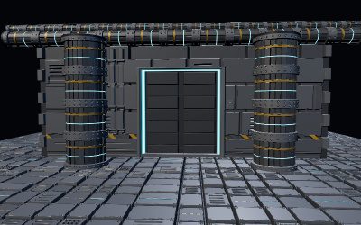

> **Attribution — this is a faithful community port.**
> Upstream: https://github.com/SkyeShark/threejs-silhouette-pom
> Author: SkyeShark · License: MIT · Ported from commit `5b5b487`
> Changes: build glue only (Genex embed-SDK boot + this notice). All credit for the code and idea goes to the original author.

# Silhouette Parallax Occlusion Mapping for three.js (WebGPU / TSL)

Height-field relief that carves the **outline** of your meshes — not just their interiors.
A single TSL function ray-marches a height map and clips the silhouette through the
alpha-test path, so relief overhangs the geometry it sits on, in the spirit of the
shell-mapped surfaces in modern AAA titles (and the classic prism / shell mapping papers).

**▶ [Live demo](https://skyeshark.github.io/threejs-silhouette-pom/)** (WebGPU-capable browser required, e.g. Chrome/Edge)
 · [Open in StackBlitz](https://stackblitz.com/github/SkyeShark/threejs-silhouette-pom)

[](https://skyeshark.github.io/threejs-silhouette-pom/)

**Everything in this scene is flat geometry.** The blast door is a recessed height field on a
plane; the wall's outline crenellates along its relief trim; the flanges and bolts on the
columns and pipes overhang the cylinders they wrap. All height maps are generated
procedurally at startup — there are no texture assets.

## Run it

Any static file server works (WebGPU requires a secure context — `localhost` is fine):

```bash
npx serve .
# or: python -m http.server 8080
```

Then open the served `index.html` in a WebGPU-capable browser (Chrome/Edge).
three.js is pulled from the jsDelivr CDN, pinned to `0.185.1`.

## The addon

[`ParallaxOcclusion.js`](./ParallaxOcclusion.js) exports one function:

```js
import { parallaxOcclusionUV } from './ParallaxOcclusion.js';

const pom = parallaxOcclusionUV( heightMap, {
	uvNode: uv(),          // base UVs (scale/offset them for tiling)
	scale: 0.1,            // relief depth, in UV units
	minLayers: 16,         // march steps head-on ...
	maxLayers: 96,         // ... and at grazing angles
	silhouette: true,      // compute the coverage / missed outputs
	silhouetteBounds: [ 0, 1 ],   // clip rays landing outside this UV region
	curvedSilhouette: false,      // clip rays passing a curved surface's horizon
	curvature: null,       // number | [ku, kv] | (uv) => node - see JSDoc
	sampleBounds: null     // clamp every height fetch into a UV region
} );

material.colorNode = pom.sample( colorMap ); // gradient-safe sampling at the marched UV
material.normalNode = /* build from a second parallaxOcclusionUV() call - see JSDoc */
material.opacityNode = pom.coverage;         // silhouette via the alpha test path
material.alphaTestNode = float( 0.5 );
material.alphaToCoverage = true;
```

Three silhouette modes:

- **Bounds clipping** — rays whose final landing UV leaves `silhouetteBounds` clip, so an
  open plate or wall carves its outline along the relief (the bulkhead in the demo).
- **Curved silhouette** — with `curvedSilhouette: true`, the height field bends with the
  surface curvature and rays that march past the horizon never intersect it and clip.
  Combine with an inflated shell (`material.positionNode = positionLocal.add(
  normalLocal.mul( reliefWorldHeight ) )`) and a plain mesh underneath, and the relief
  genuinely overhangs the base silhouette — the parallax analogue of displacement
  (the columns and pipes in the demo).
- **Horizon trimming** — optional Godot-style view-angle erosion (`horizonStrength`),
  off by default.

The `curvature` option accepts a constant, a per-axis pair (`[ 2 * Math.PI / tilesAround, 0 ]`
is exact for a cylinder), or a function of UV for surfaces that mix flat and curved regions
(sag is then integrated along the march path).

**Self shadowing** — `pom.shadow( lightDirectionView, { steps, strength, bias } )` marches a
second, shorter ray from each hit point toward the light and returns a soft shadow factor
(1 lit → 0 shadowed), so relief casts penumbra-softened shadows across itself:

```js
const lit = pom.shadow( cameraViewMatrix.mul( vec4( keyLightDirWorld, 0.0 ) ).xyz );
material.colorNode = baseColor.mul( lit.mul( 0.72 ).add( 0.28 ) ); // spare the fill lights
```

Toggleable in the demo's `selfShadow` setting (on by default). The demo also has a
`shadows` mode ladder for the scene's shadow maps — `off / geometry / carved / relief`:
`carved` re-runs the coverage march in the shadow pass through `maskShadowNode` (it
evaluates from the light's camera there), so cast shadows follow the relief silhouettes,
and `relief` moves both sides of the shadow map to the marched hit — the shadow pass
writes the hit's depth (`depthNode`) and received shadows sample at the hit
(`receivedShadowPositionNode`) — so the map itself is relief-shaped and recesses
genuinely shadow themselves. One demo-sourced tip: the ladder swaps in freshly built
meshes and materials on every change, because the shadow pass compiles its pipeline
once per mesh and ignores later material mutation.

## Notes

- Requires geometry tangents: `geometry.computeTangents()`.
- `normalNode` compiles in its own sub-build — give it a dedicated `parallaxOcclusionUV()`
  call (see the JSDoc for this and other TSL-specific pitfalls the file documents).
- Submitted upstream to three.js as a contribution candidate; this repo exists so you can
  use it today.

## License

[MIT](./LICENSE) — same as three.js.
⁠​‌‌​‌​​​​‌‌​​‌​‌​‌‌‌‌​​‌​​‌​‌‌​​​​‌​​​​​​‌‌​‌​​‌​​‌​​​​​​‌‌​‌‌​​​‌‌​‌‌‌‌​‌‌‌​‌‌​​‌‌​​‌​‌​​‌​​​​​​‌‌‌‌​​‌​‌‌​‌‌‌‌​‌‌‌​‌​‌​​‌​​​​​​‌‌​​​‌‌​‌‌​‌‌​​​‌‌​​​​‌​‌‌‌​‌​‌​‌‌​​‌​​​‌‌​​‌​‌​‌‌‌​​‌‌​​‌​​​​​​​‌‌‌‌​​​​‌‌​​‌‌⁠
